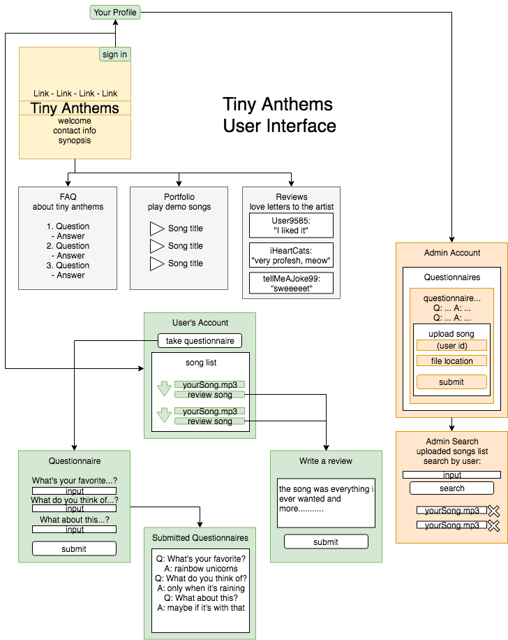
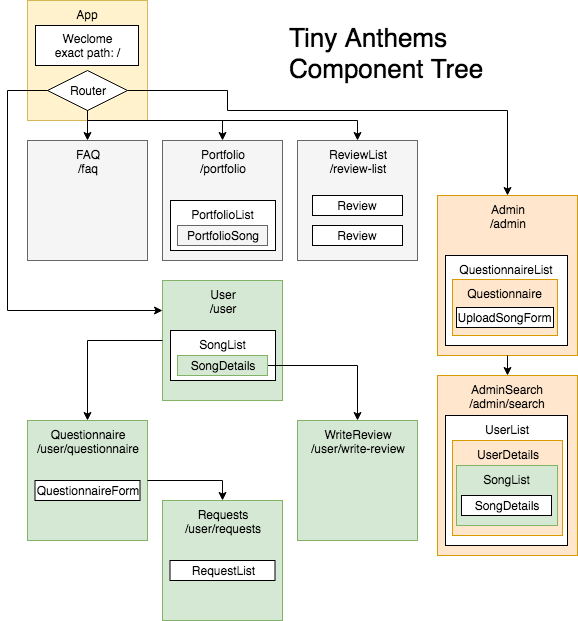

# Tiny Anthems (planning repo)
Name of Student: Chris K Johnson

Name of Project: Tiny Anthems

## [View Static App Repo](https://github.com/ckjpdx/tiny-anthems-static)





*Persistent State:*
```
{
  questionnairesById: {

  },
  songsById: {
    1: {
      userId: 1,
      title: 'a song for you',
      review: '',
      url: 'tiny-anthems.com/download/4g57hq4wf/song.mp3',
      questionnaireId: 1
    }
  },
  usersById: {
    1: {
      name: 'claire',
      questionnaires: [
        questionnairesId1,
        questionnairesId2,
        questionnairesId3
      ],
      songs: [
        songsId1,
        songsId2
      ]
    }
  },
}
```
`ex: state.users.0.questionnaires[0].status`

## Project’s Purpose or Goal:

A service for customers to commission musician Mike Long to create a song about a person after supplying information about them via questionnaire.

> As a user, I will be able to view the Welcome page, FAQ page, create an account, fill out a questionnaire on the form page, access/download the song from the song retrieval page after it has been produced, and leave reviews on the love-letters page.

> As an admin, I will be able to view pending and completed questionnaires, and upload songs to my client's account after producing them.

### List the absolute minimum features the project requires to meet this purpose or goal:

* Display welcome page with mock login form
* Navigate to FAQ page, questionnaire page, mock song retrieval page, and mock review page
* Save a demo song from a mock database inside mock login route

### What tools, frameworks, libraries, APIs, modules and/or other resources (whatever is specific to your track, and your language) will you use to create this MVP? List them all here. Be specific.

* React
* Redux
* Styled-JSX

### If you finish developing the minimum viable product (MVP) with time to spare, what will you work on next? Describe these features here: Be specific.

* User creation and sign-in authentication via database, to store completed questionnaires
* Admin login route for musician to access pending user (customer) questionnaires.
* Admin upload form to place song on database.
* User (signed in) download page to retrieve completed songs.
* User (signed in) review area to leave feedback about their experience.

### What additional tools, frameworks, libraries, APIs, or other resources will these additional features require?

* AWS database
